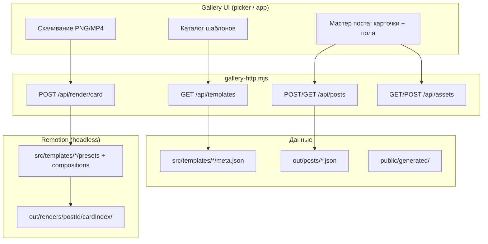

# HelloIAM Stories — ТЗ alpha v001

> **Статус:** черновик для согласования и поэтапной реализации через Cursor.  
> **Версия продукта:** `alpha v001` — после этого этапа ТЗ будет дополняться.  
> **Не путать с:** текущим «Template Studio» (галерея + CSS-импорт + Remotion Studio).

---

## 1. Цель и контекст

### Что строим

**Конструктор сторис для SMM** — веб-инструмент, в котором маркетолог за ~5 минут собирает пост из видео-карточек:

- выбирает **шаблон** (набор заранее свёрстанных карточек);
- выбирает **анимацию** для шаблона (если у шаблона несколько пресетов);
- заполняет **текст, изображения, цвета** для каждой карточки поста;
- получает **PNG и MP4 по 3 секунды на каждую карточку**.

### Пользователь

Маркетолог / SMM-специалист **без кода**. Не работает с Figma, CSS, Remotion Studio.

### Что остаётся от текущей кодовой базы

| Берём | Не берём в alpha v001 |
|-------|------------------------|
| Remotion как движок рендера | Импорт CSS / Figma |
| Галерея выбора шаблона (идея + минималистичный UI) | Remotion Studio |
| Загрузка изображений в `public/generated/` | Автогенерация `propsFields` из CSS |
| Рендер still + video (`tools/render/`) | Синхронизация props Studio ↔ gallery |
| Docker + деплой на тот же VPS / тот же репозиторий | Новый контейнер / новый репозиторий |
| Шаблоны как код в `src/templates/` (layout, preset, meta) | Универсальный редактор layout |

### Принцип alpha v001

**Шаблоны и поля карточек задаются вручную разработчиком** — без универсальной схемы под CSS-импорт. Каждый шаблон может иметь своё число карточек и свой набор полей на карточку.

---

## 2. Минимальный пайплайн пользователя

```
┌─────────────────────────────────────────────────────────────┐
│ 1. ВОЙТИ В ПРИЛОЖЕНИЕ                                       │
│    Открыть gallery (локально или на VPS)                    │
└──────────────────────────┬──────────────────────────────────┘
                           ▼
┌─────────────────────────────────────────────────────────────┐
│ 2. ВЫБРАТЬ ШАБЛОН                                           │
│    Каталог шаблонов (проект AM News / AM Food и т.д.)       │
│    Превью-обложка, название, тег анимации                   │
└──────────────────────────┬──────────────────────────────────┘
                           ▼
┌─────────────────────────────────────────────────────────────┐
│ 3. СОЗДАТЬ ПОСТ                                            │
│    Кнопка «Создать пост» → мастер редактирования            │
│    • вкладки / шаги по карточкам (Карточка 1, 2, 3…)        │
│    (выбор анимации — не в alpha v001)                       │
│    • на каждой карточке — свои поля (хардкод шаблона):      │
│      тексты, картинки, цвета фона и текста                  │
└──────────────────────────┬──────────────────────────────────┘
                           ▼
┌─────────────────────────────────────────────────────────────┐
│ 4. СОХРАНИТЬ И СКАЧАТЬ                                      │
│    «Сохранить пост» → данные поста на сервере / в файле     │
│    «Скачать» / «Рендер» → для КАЖДОЙ карточки отдельно:    │
│      still.png + video.mp4 (3 сек, размер из шаблона)        │
└─────────────────────────────────────────────────────────────┘
```

**Целевое время:** ≤ 5 минут от входа до скачивания всех карточек.  
**Live-превью** в редакторе — мгновенное HTML-превью; финальный PNG/MP4 — через Remotion.

---

## 3. Ключевые понятия

### Шаблон (Template)

Заранее подготовленный набор карточек одного визуального стиля.

```ts
// Концептуальная модель (не финальный код)
type Template = {
  id: string;                    // "am-news-carousel-v1"
  project: string;               // "am-news"
  name: string;
  description: string;
  width: number;                 // захардкожено, из исходного CSS-экспорта
  height: number;
  fps: number;                   // 30
  durationPerCardSec: number;    // 3 → durationFrames = fps * 3
  animations: AnimationOption[]; // доступные пресеты
  cards: TemplateCardDef[];      // описание карточек шаблона
};

type TemplateCardDef = {
  cardIndex: number;             // 0, 1, 2…
  compositionId: string;           // Remotion composition для этой карточки
  label: string;                 // «Обложка», «Цитата»…
  fields: FieldDef[];            // хардкод полей именно для этой карточки
};

type FieldDef = {
  key: string;
  type: 'string' | 'textarea' | 'color' | 'image';
  label: string;
  required?: boolean;
};
```

**Важно:** у шаблона A карточка 1 может иметь 3 текстовых поля, у карточки 2 — одно; у шаблона B — другая структура. Это **норма**, не баг.

### Пост (Post / Instance)

Конкретная пользовательская работа: выбранный шаблон + выбранная анимация + заполненные props по каждой карточке.

```ts
type Post = {
  id: string;                    // uuid
  templateId: string;
  animationId: string;           // выбранный пресет
  createdAt: string;
  cards: PostCardData[];
};

type PostCardData = {
  cardIndex: number;
  compositionId: string;
  props: Record<string, string>; // значения полей пользователя
};
```

### Рендер карточки

Один вызов рендера = **одна карточка** → `still.png` + `video.mp4` (3 сек).  
Пост из 4 карточек = 4 независимых рендера (можно последовательно в alpha v001).

---

## 4. Целевая архитектура



### Что убираем из runtime alpha v001

| Компонент | Действие |
|-----------|----------|
| Remotion Studio (`:3000`) | Удалить из `npm start`, убрать кнопку «Открыть» |
| CSS-импорт UI в gallery | Убрать из UI |
| `tools/css-import/`, `packages/css-pipeline/` | Перенести в `_archive/` |
| `propsFields` автоген из CSS | Не использовать; поля только ручные в `meta.json` |
| `sync:gallery` завязка на CSS-импорт | Упростить: manifest только для заранее описанных шаблонов |

---

## 5. Архив legacy-фич (не удалять, изолировать)

Чтобы не загрязнять контекст Cursor и код alpha v001:

```
_archive/
├── README.md              # «Не использовать в alpha v001»
├── css-import/            # ← tools/css-import/
├── css-pipeline/          # ← packages/css-pipeline/
└── docs/
    └── LEGACY_STUDIO.md   # описание старого flow (Studio + CSS)
```

**Правила:**
- В `package.json` alpha v001 нет скриптов `import:css`, `studio`, `sync:gallery` (или они помечены `_archive` и не документируются в README).
- В `picker.html` нет блоков импорта CSS.
- Активный README ссылается только на **Stories alpha v001**.

Исходные шаблоны в `src/templates/` **остаются** как основа Remotion-композиций; новая структура `meta.json` описывает мульти-карточность вручную.

---

## 6. UI экраны (минимальный набор)

| Экран | URL (hash) | Содержание |
|-------|------------|------------|
| **Главная** | `/` | Проекты, сетка шаблонов, кнопка «Создать пост» |
| **Мастер поста** | `/#/post/new?template=...` | Выбор анимации → редактор карточек |
| **Редактор карточки** | часть мастера | Форма полей из `TemplateCardDef.fields` |
| **Результат** | `/#/post/:id` | Список карточек, статус рендера, ссылки PNG/MP4 |

**Стиль:** минималистичный, как текущий `picker.html` (тёмная/светлая панель, карточки, accent-кнопки). Без Figma, без Studio.

---

## 7. API alpha v001

| Метод | Путь | Назначение |
|-------|------|------------|
| GET | `/api/templates` | Список шаблонов с `cards[]`, `animations[]` |
| GET | `/api/templates/:id` | Полное описание шаблона |
| POST | `/api/posts` | Создать пост `{ templateId, animationId }` |
| GET | `/api/posts/:id` | Получить пост + props карточек |
| PUT | `/api/posts/:id/cards/:index` | Сохранить props одной карточки |
| POST | `/api/posts/:id/render` | Запустить рендер всех карточек (или по одной) |
| POST | `/api/render/card` | `{ postId, cardIndex }` → PNG + MP4 одной карточки |
| GET | `/api/assets` | Список изображений |
| POST | `/api/assets/upload` | Загрузка изображения |

**Хранение постов (MVP):** `out/posts/<postId>.json` (или `data/posts/`). Без БД в alpha v001.

---

## 8. Шаблон meta.json (новый формат, ручной)

Пример для шаблона с 2 карточками:

```json
{
  "id": "AmNewsCarouselV1",
  "project": "am-news",
  "name": "AM News — карусель 2 кадра",
  "version": "alpha-v001",
  "width": 1080,
  "height": 1350,
  "fps": 30,
  "durationPerCardSec": 3,
  "animations": [
    { "id": "soft-float", "name": "Мягкое покачивание", "preset": "soft-float" }
  ],
  "cards": [
    {
      "cardIndex": 0,
      "compositionId": "Post126SoftFloat",
      "label": "Обложка",
      "fields": [
        { "key": "title", "type": "string", "label": "Заголовок" },
        { "key": "image", "type": "image", "label": "Фото" },
        { "key": "background", "type": "color", "label": "Фон" },
        { "key": "titleColor", "type": "color", "label": "Цвет заголовка" }
      ],
      "defaultProps": { "...": "..." }
    },
    {
      "cardIndex": 1,
      "compositionId": "Post103Css",
      "label": "Текст",
      "fields": [
        { "key": "body", "type": "textarea", "label": "Текст" },
        { "key": "background", "type": "color", "label": "Фон" }
      ],
      "defaultProps": { "...": "..." }
    }
  ]
}
```

Разработчик вручную связывает `compositionId` с существующими Remotion-композициями в `src/templates/`.

---

## 9. Рендер

- **Длительность:** 3 сек на карточку (`durationFrames = fps * 3`, обычно 90 при 30 fps).
- **Выход:** `out/renders/<postId>/<cardIndex>/still.png` + `video.mp4`.
- **Движок:** существующий `tools/render/render-composition.mjs` — адаптировать под `compositionId` + props карточки поста (не `meta.defaultProps` целиком).
- **Форматы:** PNG (первый кадр или still) + MP4 — оба варианта для каждой карточки.

---

## 10. Деплой

Без изменений инфраструктуры:

- Тот же репозиторий `helloiam-studio`
- Тот же контейнер на VPS (`scripts/deploy-hostinger.sh`)
- После каждой итерации: push → `REMOTE=helloiam-studio ./scripts/deploy-hostinger.sh`

Переименование продукта в UI/README — по желанию в полировке (HelloIAM Stories).

---

## 11. План реализации по промптам

### Итерация MVP (4 промпта)

#### Промпт 1 — «Зачистка и архив»
**Задача:** подготовить кодовую базу под новый продукт.

- Создать `_archive/`, перенести `tools/css-import`, `packages/css-pipeline`
- Убрать Remotion Studio из `npm start` (только gallery `:3456`)
- Удалить из UI: импорт CSS, кнопка «Открыть Studio»
- Обновить `README.md` → Stories alpha v001
- `package.json`: убрать/закомментировать `studio`, `import:css`, `sync:gallery`

**Готово когда:** `npm run gallery` работает, legacy не виден в UI и README.

---

#### Промпт 2 — «Модель шаблона и поста»
**Задача:** новый формат `meta.json` + хранение постов.

- Описать 1 пилотный шаблон с 2–3 карточками вручную в `meta.json`
- API: `GET /api/templates`, `GET /api/templates/:id`
- API: `POST /api/posts`, `GET /api/posts/:id`, `PUT .../cards/:index`
- Упростить manifest / Root без Studio-зависимостей

**Готово когда:** curl создаёт пост и сохраняет props карточек.

---

#### Промпт 3 — «UI мастера поста»
**Задача:** пользовательский flow из §2.

- Главная: каталог + «Создать пост»
- Мастер: выбор анимации → вкладки карточек → формы полей
- Загрузка изображений (существующий `/api/assets`)
- Сохранение без превью

**Готово когда:** маркетолог заполняет пост в браузере без Studio.

---

#### Промпт 4 — «Рендер по карточкам»
**Задача:** PNG + MP4 на каждую карточку.

- `POST /api/posts/:id/render` или `/api/render/card`
- Адаптировать `render-composition.mjs` под props из поста
- UI: статус рендера + ссылки на скачивание

**Готово когда:** пост из 3 карточек → 3 пары PNG/MP4 по 3 сек.

---

### Полировка (2–3 промпта, после alpha v001)

| Промпт | Задача |
|--------|--------|
| **П5** | UX: прогресс рендера, ошибки, валидация полей |
| **П6** | 2–3 полноценных шаблона в каталоге, обложки |
| **П7** | Деплой + smoke на VPS, тексты UI на русском |

---

## 12. Критерии успеха alpha v001

- [x] Маркетолог заходит на gallery, **не видит** CSS-импорт и Studio
- [x] Выбирает шаблон → «Создать пост» → заполняет **каждую карточку** своими полями
- [x] Сохраняет пост, запускает рендер
- [x] Получает **отдельные** PNG и MP4 (3 сек) **на каждую карточку**
- [x] Legacy в `_archive/`, не мешает разработке
- [x] Деплой на текущий VPS работает

---

## 13. Решения (согласовано)

| # | Вопрос | Решение |
|---|--------|---------|
| 1 | Пилот | 2 карточки: `post-126` + `post-103` |
| 2 | Страницы UI | **Генерация** и **Посты** — две отдельные вкладки |
| 3 | Выбор анимации | **Нет** в alpha v001 (один пресет на шаблон) |
| 4 | Рендер | **Все карточки** одной кнопкой |
| 5 | Переименование UI | В **полировке** (П7) |
| 6 | Лишние шаблоны | **Удалены**; только пилот, новые добавим вручную |
| 7 | Подход к сложности | Прагматично: если код упирается в стену — упрощать, не идеал по пикселю |

**Принцип разработки:** минимальное работающее приложение важнее точного соответствия макету.

---

## 14. Связь с будущими этапами

После alpha v001 в ТЗ будут добавлены (не в scope сейчас):

- live-превью карточки;
- возврат CSS-импорта из `_archive/` для ускорения создания шаблонов;
- очередь рендеров;
- несколько анимаций на выбор в UI;
- экспорт всего поста одним ZIP.

---

## 15. Статус реализации

- [x] **Промпт 1** — архив `_archive/`, убраны Studio/CSS, пилот PilotV1, UI: Генерация | Посты
- [x] **Промпт 2** — API постов (`data/posts/`), мастер редактирования карточек
- [x] **Промпт 3** — (объединён с П2) создание поста + вкладки карточек + список постов
- [x] **Промпт 4** — рендер всех карточек (PNG + MP4)

- [x] **Промпт 5** — прогресс рендера, валидация полей, ZIP, скачивание на вкладке «Посты»

- [x] **Промпт 6** — шаблоны HelloIAM (9 карточек + вино 2 карточки)
- [x] **Промпт 7** — деплой VPS, русский UI, переименование в HelloIAM Stories

- [x] **Live-превью** — мгновенное превью карточки в редакторе (`preview-layouts.json`)
- [x] **Очередь рендера** — сериализация Remotion (`render-lock.mjs`, без параллельных OOM)
- [x] **Обложки шаблонов** — превью первой карточки в каталоге
- [x] **Удаление постов**, автосохранение, рендер одной карточки

*Alpha v001 + post-release polish complete.*

---

## 16. Rubric v2 glossary (call recording, 2026)

### Terminology

| UI (EN) | Was in code | JSON field | Meaning |
|---------|-------------|------------|---------|
| **Rubric** | Format, template | `templateId` → `Rubric01`…`Rubric05` | Layout + card count + pipeline |
| **Topic** | category label | `category` → `AM FOOD` etc. on slides | FOOD / SOUNDS / CULTURE / PLACES / NEWS |
| **Subject** | `post.subject` | `subject` | Auto = `item` from emoji (LLM `{subject}`); not user-entered on Rubric 01–04 |
| **Post name** | `name` | `name` | Auto: `{rubricName} · {item}` (Rubric 05: `{rubricName} · {infopov}`) |
| **Headline item** | `titleAccent` | `item` | From emoji, UPPERCASE |
| **Slide text** | `quote` | `fact` | Only LLM-generated text per slide |
| **Color style** | `themeColor` swatches | `colorStyleId` | Preset in Settings only |

### Rubric rename map

| Rubric | Cards | Old `templateId` | New `templateId` | Old file | New file |
|--------|-------|------------------|------------------|----------|----------|
| Rubric 01 | 9 | `Format01` | `Rubric01` | `format-01.json` | `rubric-01.json` |
| Rubric 02 | 2 | `HelloIamWineV1` | `Rubric02` | `helloiam-wine-v1.json` | `rubric-02.json` |
| Rubric 03 | 7 | `IAmMatsunDeepDive` | `Rubric03` | `iam-matsun-deep-dive.json` | `rubric-03.json` |
| Rubric 04 | 3 | `GreenPlateIntro` | `Rubric04` | `green-plate-intro.json` | `rubric-04.json` |
| Rubric 05 | 3 | `HelloIamNewsV1` | `Rubric05` | `format-05-news.json` | `rubric-05.json` |

Legacy `templateId` values are aliased at read time for one release.

### Emoji placement

| Rubric | First slide | Last slide |
|--------|-------------|------------|
| 01, 02, 05 | — | emoji sticker |
| 03, 04 | emoji | emoji |

### Content pipeline

1. **Settings** — Rubric, Topic, Emoji (→ item), Color style. Rubric 05: Infopov only.
2. **Content** — Write all slide texts → picture descriptions → make all pictures.
3. **Export** — Build PNG stills.
4. **Download** — ZIP.

### Plain language (no jargon in UI)

| Avoid | Use |
|-------|-----|
| prompt, LLM, render | picture description, slide text, build PNG |
| Generate content | Write all slide texts |

